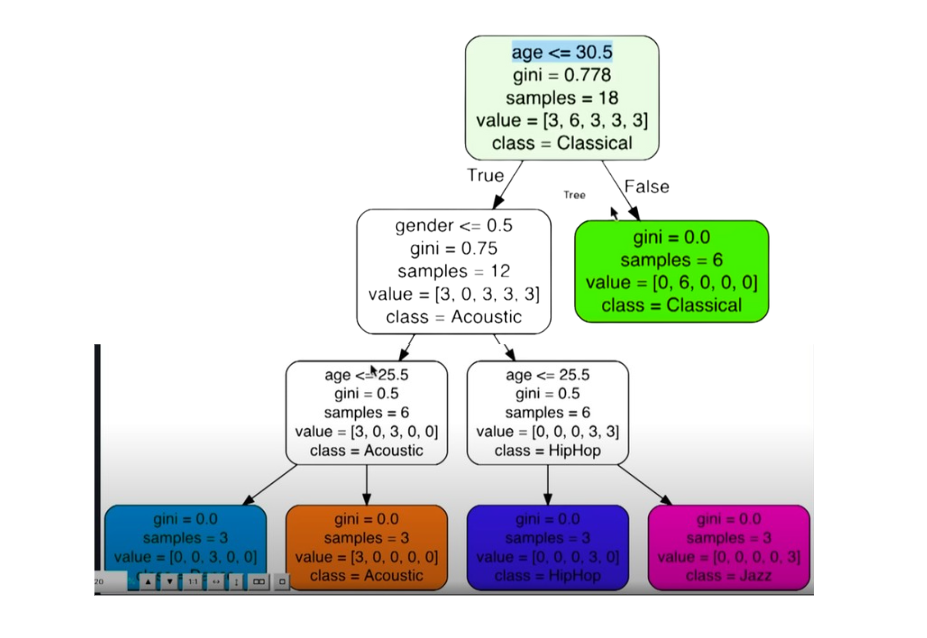

# Python Learning Journey 🚀

This repository documents my comprehensive journey through Python programming, from basics to advanced applications including Machine Learning and Web Development.

## 🎯 Repository Contents

1. **Python Fundamentals**
   - Basic Python syntax and concepts
   - Data structures and algorithms
   - File handling and automation

2. **Excel Automation**
   - Python scripts for Excel data processing
   - Automated reporting systems
   - Data analysis using pandas

3. **Machine Learning Projects**
   - Music Genre Prediction Model

   
   <!-- Add your model accuracy screenshot here -->

4. **Django Web Application - PyShop**
   - Full-featured e-commerce platform
   - Product management system
   - User authentication

   .png)
   <!-- Add your PyShop application screenshot here -->

5. **Jupyter Lab Projects**
   - Data analysis notebooks
   - Visualization examples
   - Interactive computing demonstrations


## 🛠️ Technologies Used

- Python 3.x
- Django Framework
- Jupyter Lab
- Pandas
- Scikit-learn
- NumPy
- Machine Learning Libraries
- Excel Integration Tools

## 📦 Installation

1. Clone the repository:
```bash
git clone https://github.com/yourusername/Python_learning.git
```

2. Create a virtual environment:
```bash
python -m venv venv
source venv/bin/activate  # On Windows: venv\Scripts\activate
```

3. Install required packages:
```bash
pip install -r requirements.txt
```

## 🚀 Project Setup and Usage

### PyShop Django Application
1. Navigate to the PyShop directory
2. Run migrations:
```bash
python manage.py migrate
```
3. Start the development server:
```bash
python manage.py runserver
```

### Jupyter Lab Projects
1. Launch Jupyter Lab:
```bash
jupyter lab
```
2. Navigate to the notebooks directory to access various projects


## 🎯 Learning Outcomes

- Python programming fundamentals
- Data manipulation and analysis
- Machine learning model development
- Web application development with Django
- Database management
- Version control with Git

